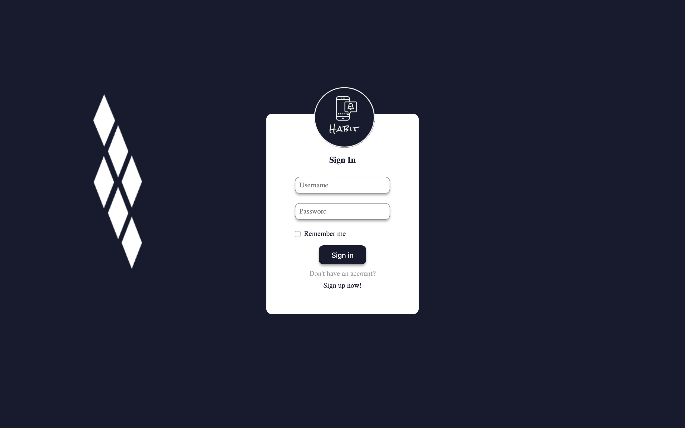

# Welcome to CS162 Habit Team's Final Project!

## Let's Show You Around

### To get the app running on your machine, complete the following steps:

1. Clone the repo and cd into it
```bash
git clone https://github.com/minerva-schools/cs162-habit.git | cd cs162-habit
```

2. Create / Activate Virtual Environment (requires python3 and virtualenv)
```bash
python3 -m venv venv && source venv/bin/activate
```

3. Install dependencies
```bash
pip3 install -r requirements.txt
```

4. Run the app!
```bash
python3 -m flask run
```

Navigate to [localhost:5000](localhost:5000) and you should see a link to sign up and play around!



## Running Tests

### Unit Tests

To run the unit tests, complete the following steps:

1. Create / Activate Virtual Environment
```bash
python3 -m venv venv_unit && source venv_unit/bin/activate
```

2. Install unit_test dependencies
```bash
pip3 install -r requirements-unit.txt
```

3. Run the unit tests
```bash
pytest unit_test
```

All tests should pass.

## Integration Tests

Note: Make sure you have the local server up and running! Due to time constraints, no significant integration test development occurred.

To run the integration test, complete the following steps:

1. Create / Activate Virtual Environment
```bash
python3 -m venv venv_integration && source venv_integration/bin/activate
```

2. Install integration_test dependencies
```bash
pip3 install -r requirements-integration.txt
```

3. Run the integration tests
```bash
pytest integration_test
```

All tests should pass.

## Contributors
- [Zane Sand](): Team Lead / DevOps & Backend
- [Tom Kremer](https://www.linkedin.com/in/tom-kremer/): Backend
- [Zineb Salimi](https://www.linkedin.com/in/zineb-salimi-54a1a3149/): Backend
- [Nour Elkhalawy](https://www.linkedin.com/in/nour-elkhalawy/): Design / Backend
- [Nathan Torento](https://www.linkedin.com/in/nathantorento/): Frontend
- [Vu Luong](https://www.linkedin.com/in/vuluong/): Frontend
